# Microservices Kubernetes Deployment Assessment


> End-to-end deployment of a containerized Node.js microservices application on Kubernetes using Minikube with ClusterIP Services, Health Probes, Resource Management and NGINX Ingress.

---

# Table of Contents

1. Project Overview
2. Architecture
3. Application Components
4. Repository Structure
5. Technology Stack
6. Environment
7. Prerequisites
8. Docker Images
9. Minikube Setup
10. Kubernetes Deployment
11. Service Discovery
12. Health Checks
13. Resource Management
14. Validation
15. Ingress
16. Troubleshooting
17. Screenshot Gallery
18. Learning Outcomes
19. Future Improvements
20. Author

---

# Project Overview

This project demonstrates deployment of four Node.js microservices on a local Kubernetes cluster created with Minikube.

The implementation includes:

- Kubernetes Deployments
- ClusterIP Services
- Labels & Selectors
- Resource Requests and Limits
- Liveness Probes
- Readiness Probes
- Internal DNS based Service Discovery
- API Gateway
- Bonus NGINX Ingress

---

# Architecture

```text
                         Client
                            │
              kubectl port-forward / Ingress
                            │
                    Gateway Service
          ┌─────────────────┼─────────────────┐
          │                 │                 │
          ▼                 ▼                 ▼
   User Service      Product Service    Order Service
```

---

# Application Components

| Service | Port | Purpose |
|---------|-----:|---------|
| User Service | 3000 | Returns users |
| Product Service | 3001 | Returns products |
| Order Service | 3002 | Creates & returns orders |
| Gateway Service | 3003 | API Gateway |

# Repository Structure

```text
Microservices-Kubernetes-Task/
├── deployments/
├── services/
├── ingress/
├── screenshots/
├── Microservices/
├── README.md
├── LICENSE
└── .gitignore
```

# Technology Stack

- Kubernetes
- Minikube
- Docker
- Node.js
- Express.js
- Git
- YAML

# Environment

| Component | Version |
|-----------|---------|
| Ubuntu | 22.04 |
| Kubernetes | v1.35 |
| Minikube | v1.38.1 |
| Docker | 29.x |

# Prerequisites

- Docker Engine
- kubectl
- Minikube
- Git

# Start Minikube

```bash
minikube start --driver=docker --cpus=2 --memory=4096
minikube status
kubectl get nodes
```

# Load Docker Images

```bash
minikube image load microservices-task-user-service:latest
minikube image load microservices-task-product-service:latest
minikube image load microservices-task-order-service:latest
minikube image load microservices-task-gateway-service:latest
```

# Deploy Kubernetes Resources

```bash
kubectl apply -f deployments/
kubectl apply -f services/
kubectl get deployments
kubectl get pods
kubectl get svc
```

# Service Discovery

Internal communication uses Kubernetes DNS:

- http://user-service:3000
- http://product-service:3001
- http://order-service:3002

# Health Checks

Each Deployment includes:

- Liveness Probe
- Readiness Probe
- Resource Requests
- Resource Limits
- Labels
- Selectors
- imagePullPolicy: Never

# Validation

```bash
kubectl port-forward service/gateway-service 3003:3003

curl http://localhost:3003/api/users
curl http://localhost:3003/api/products
curl http://localhost:3003/api/orders

curl -X POST http://localhost:3003/api/orders -H "Content-Type: application/json" -d '{"userId":1,"productId":2}'
```

# Bonus - NGINX Ingress

```bash
minikube addons enable ingress
kubectl apply -f ingress/ingress.yaml
kubectl get ingress
```

Update `/etc/hosts`

```text
<MINIKUBE_IP> microservices.local
```

# Troubleshooting

```bash
kubectl describe pod <pod-name>
kubectl logs <pod-name>
kubectl rollout restart deployment/<deployment-name>
```

# Screenshot Gallery

| # | Preview |
|---|---|
| 01 | 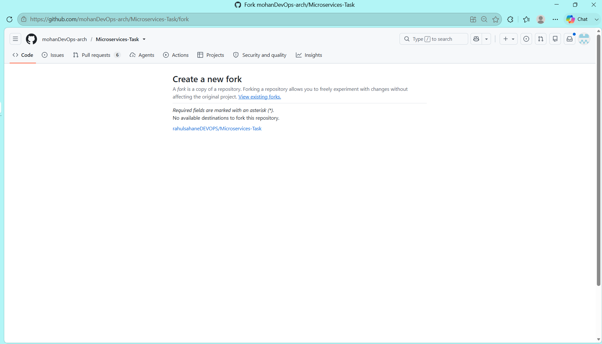 |
| 02 | 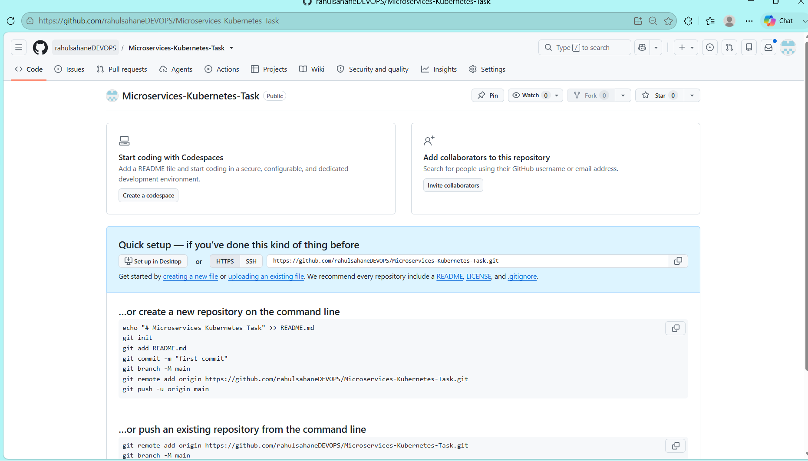 |
| 03 | 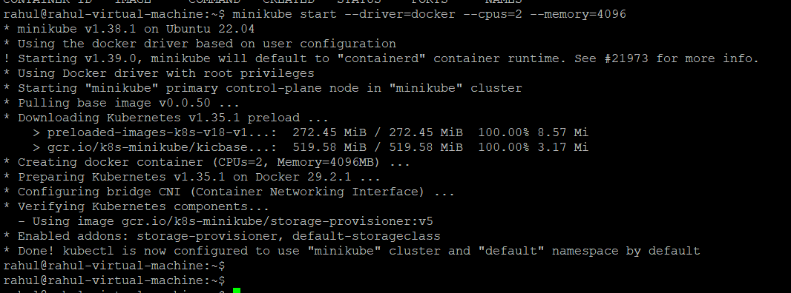 |
| 04 | 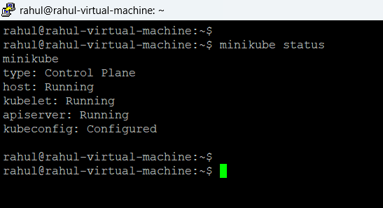 |
| 05 | 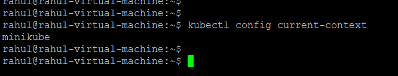 |
| 06 | 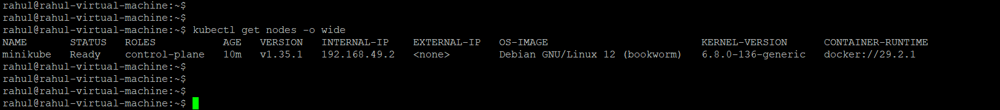 |
| 07 | 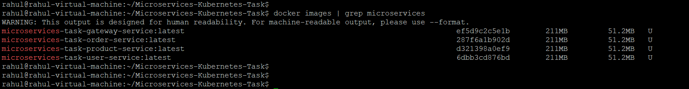 |
| 08 | 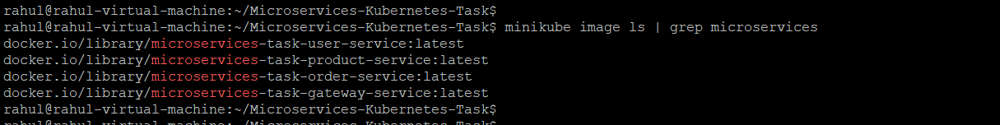 |
| 09 | 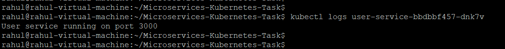 |
| 10 | 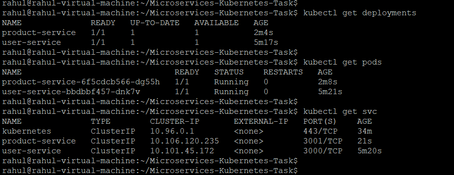 |
| 11 | 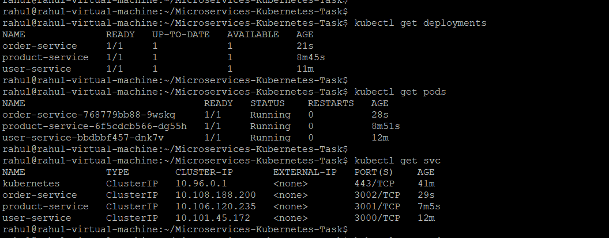 |
| 12 | 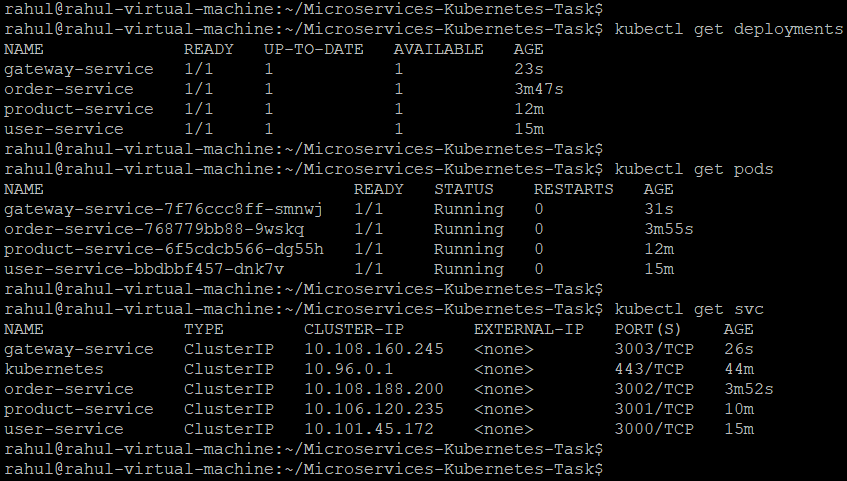 |
| 13 | 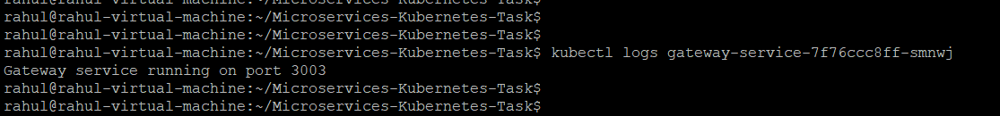 |
| 14 | 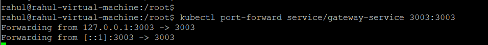 |
| 15 | 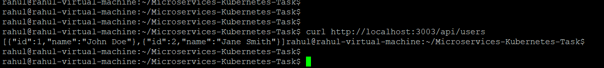 |
| 16 | 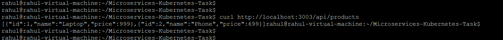 |
| 17 | 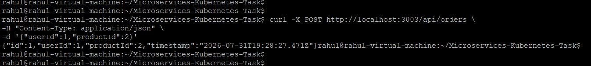 |
| 18 | 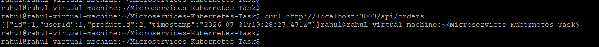 |
| 19 | 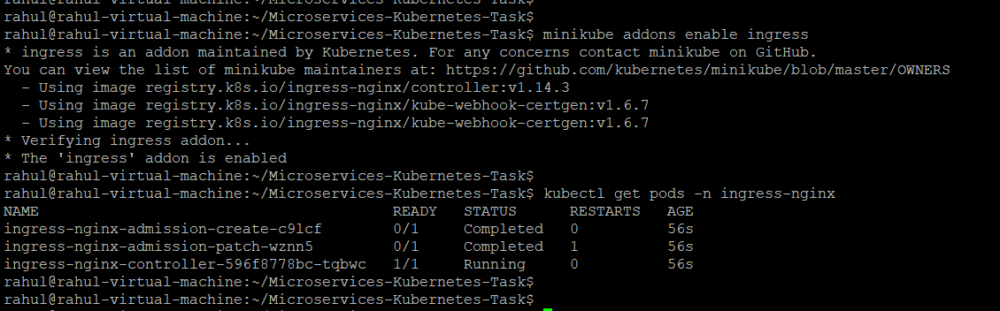 |
| 20 | 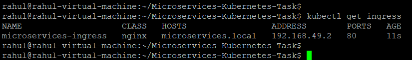 |
| 21 | 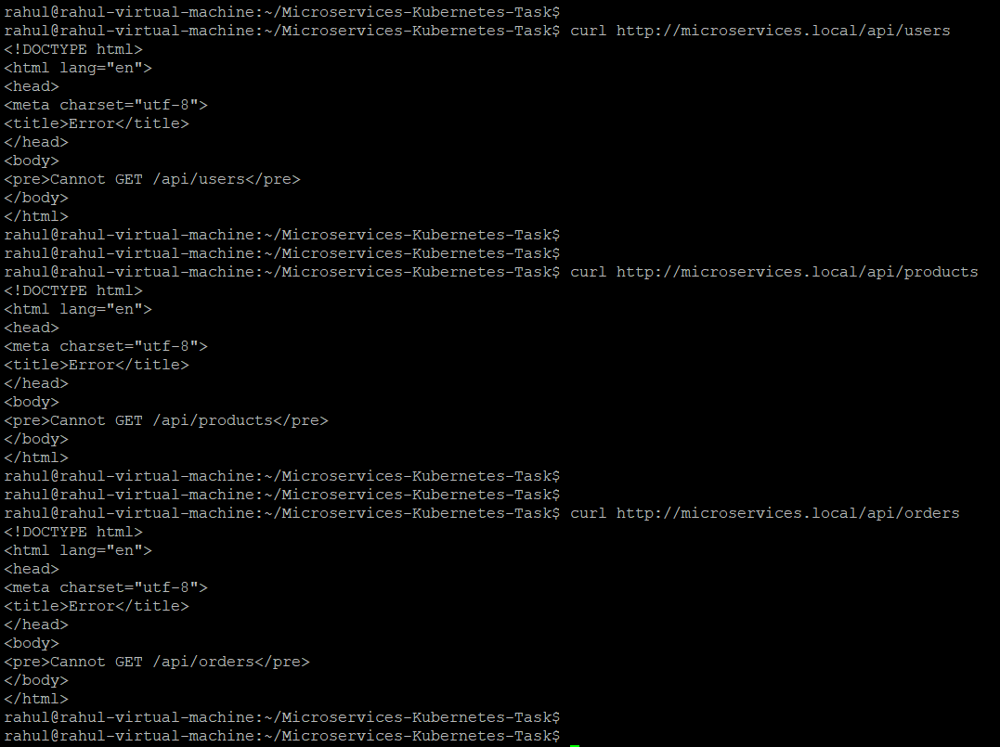 |


# Learning Outcomes

- Built Docker images for multiple services
- Deployed workloads using Kubernetes Deployments
- Exposed applications with ClusterIP Services
- Implemented health probes
- Used Kubernetes DNS for service discovery
- Validated microservice communication
- Configured NGINX Ingress
- Documented deployment using GitHub

# Future Improvements

- ConfigMaps
- Secrets
- Persistent Volumes
- Helm Charts
- Horizontal Pod Autoscaler
- CI/CD with GitHub Actions
- Prometheus & Grafana monitoring

# Assignment Checklist

| Requirement | Status |
|------------|:------:|
| Deployments | ✅ |
| Services | ✅ |
| Requests & Limits | ✅ |
| Environment Variables | ✅ |
| Readiness Probe | ✅ |
| Liveness Probe | ✅ |
| ClusterIP | ✅ |
| Service Discovery | ✅ |
| Gateway Validation | ✅ |
| Bonus Ingress | ✅ |

# Author

**Rahul Sahane**

GitHub: https://github.com/rahulsahaneDEVOPS/Microservices-Kubernetes-Task
